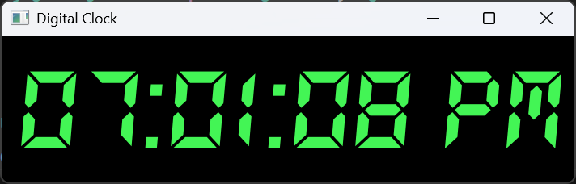

# 🕒 Digital Clock using PyQt5

A sleek and minimal **digital clock GUI application** built using Python and PyQt5.  
It displays the current system time with custom digital-style fonts and real-time updates every second.

---

## 🚀 Features

- Custom digital font (DS_DIGIT.TTF)
- Real-time clock updates every second
- Styled with green-on-black digital theme
- Center-aligned time display
- Clean and responsive layout using `QVBoxLayout`

---

## 📸 Screenshot




---

## 🛠️ Technologies Used

- Python 3.x
- PyQt5
- QTimer, QLabel, QVBoxLayout
- QFontDatabase for custom font handling

---

## 📦 How to Run

Make sure PyQt5 is installed:
```bash
pip install PyQt5

Then, run the program:
python digitalClock.py

Ensure the following files are in the same directory:

digitalClock.py
DS_DIGIT.TTF
screenshot.png (optional, for preview)
